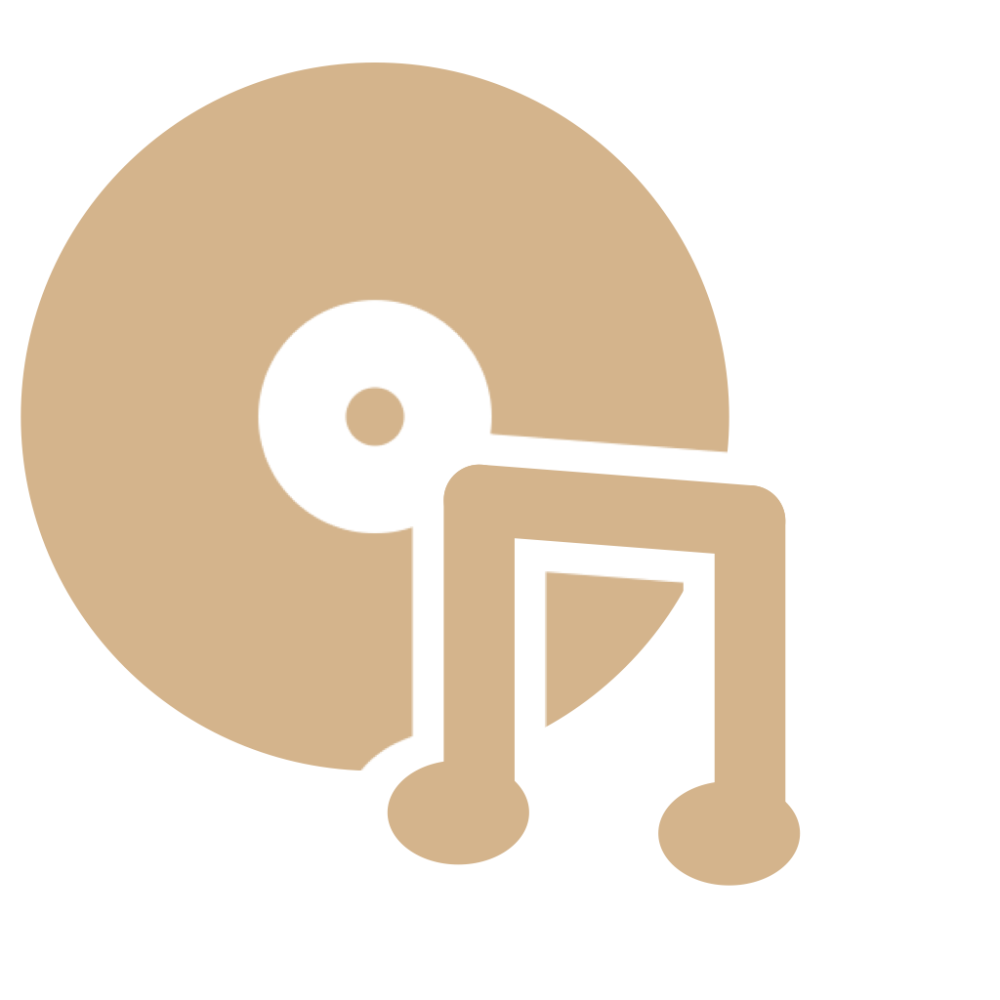
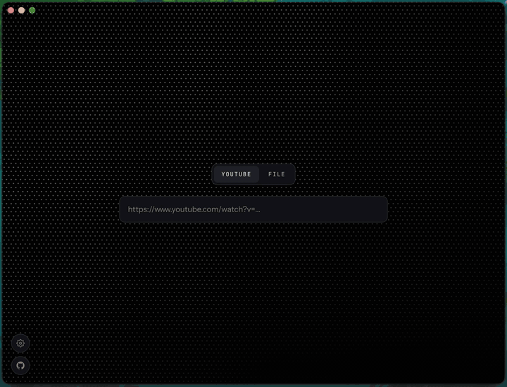

  

<h1 align="center">TrackTag</h1>

  Download, trim, tag. A macOS app that turns YouTube videos and local files 
  into cleanly tagged MP3s, with AI doing the boring part.

  
  
  

  

## Download

**[⬇ Download TrackTag for macOS](https://github.com/lebuckman/tracktag/releases/latest/download/TrackTag.dmg)**

Open the DMG, drag TrackTag into Applications, done. Requires an Apple Silicon Mac.

> [!IMPORTANT]
> TrackTag is unsigned (no Apple Developer subscription), so macOS will balk on first open:
> _"TrackTag can't be opened because Apple cannot check it for malicious software."_
>
> The fix: try to open the app once, then go to **System Settings → Privacy & Security**, scroll down to the blocked-app message, and click **Open Anyway**. On older macOS versions, right-click the app and choose **Open** instead.
>
> Because each download is a new unsigned file, this repeats once per update. It is the price of free distribution.

## What it does

TrackTag is for the music that never makes it to streaming: live performances, covers from music shows, concert recordings. It turns them into cleanly tagged MP3s that look right in Spotify Local Files, Apple Music, or any other player.

1. **Paste a YouTube link**, or drop in a local audio or video file.
2. **Hit Autofill.** Gemini reads the video's title and description and fills in Title, Artist, and Album using rules tuned for music: cover and version notation, event and OST album naming. Edit anything it gets wrong, or skip it and type the tags yourself.
3. **Trim if you want.** An inline control cuts intros and outros, or pulls one song out of a full set.
4. **Save.** Pick a folder once and TrackTag remembers it. Out comes a clean MP3 with tags and album art baked in.

## The Gemini key (optional)

Autofill is powered by Google Gemini and needs an API key, free at [aistudio.google.com](https://aistudio.google.com/apikey). The app asks once on first launch; paste it or skip. Without a key everything works, you just fill the fields in yourself. The key is stored only on your Mac and is only ever used to request tags.

## Good to know

- **If downloads suddenly fail, quit and reopen the app.** Downloads run through yt-dlp, which YouTube breaks every few weeks by changing its player code. TrackTag fetches the latest yt-dlp on launch, so a relaunch usually picks up the fix without an app update.
- **If YouTube complains about automation, wait a minute.** Several downloads in quick succession can make YouTube temporarily flag the connection. It clears on its own.
- **App updates are noticed for you.** When a newer release exists, the app shows a small notice linking to the download. Installing is drag-and-drop again, including the Open Anyway step above.
- **Some videos won't download.** Age-restricted, region-locked, and members-only videos need a signed-in session, which TrackTag doesn't have.
- **Autofill needs an internet connection and a per-minute budget.** The free Gemini tier rate-limits aggressively; if Autofill reports a rate limit, wait a minute and retry.
- **This is a personal tool.** It exists to tag your own library, not to run a download service. If you fork it, keep it personal.

## Contributing

Before contributing code, please read the guidelines in [CONTRIBUTING.md](CONTRIBUTING.md), which also covers building from source.

## License

All code and content unique to TrackTag is licensed under MIT. See [LICENSE](LICENSE).

The binaries TrackTag bundles retain their original licenses: [yt-dlp](https://github.com/yt-dlp/yt-dlp) is released under the Unlicense, and [ffmpeg](https://ffmpeg.org) (a GPL build, via ffmpeg-static) under GPL-3.0.
